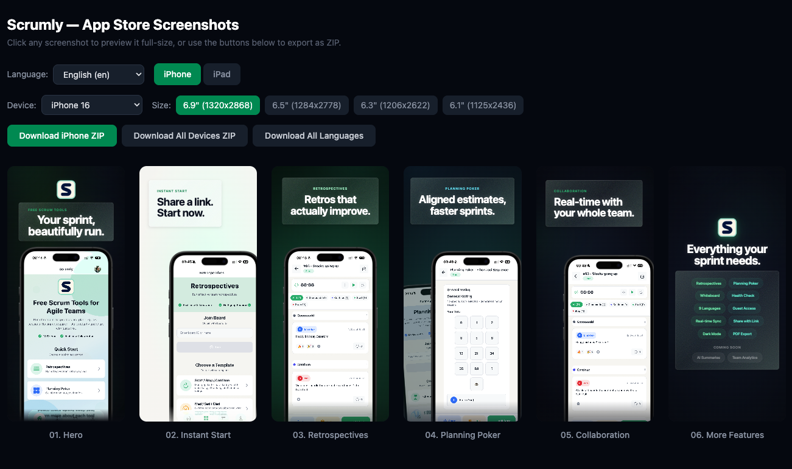

# App Store Screenshots Generator

A skill for AI-powered coding agents (Claude Code, Cursor, Windsurf, etc.) that generates production-ready App Store screenshots for **iPhone, iPad, Apple Watch, and Mac**. Scaffolds a Next.js project, designs advertisement-style screenshots with **multi-language localization**, and exports them as categorized ZIPs at all Apple-required resolutions.



## What it does

- Asks about your app's brand, features, target platforms, and style preferences
- Scaffolds a minimal Next.js project (or works within an existing one)
- Designs each screenshot as an **advertisement** — not a UI showcase
- Writes compelling copy using proven App Store copywriting patterns
- Supports **multi-language localization** with per-locale font handling, RTL support, and dynamic font scaling
- Renders screenshots at full resolution with built-in device mockups
- Exports categorized ZIPs at all Apple-required sizes — drag and drop into App Store Connect

## Supported platforms

| Platform | Mockups included | Export sizes |
|----------|-----------------|-------------|
| iPhone | 10 models (iPhone 17 Pro Max → 13 mini) | 6.9", 6.5", 6.3", 6.1", 5.5" |
| iPad | 8 models (Pro 13" → mini, portrait + landscape) | 13", 11", 10.5", 9.7" |
| Mac | 3 models (MacBook Air, MacBook Pro, iMac) | Retina, Large, Medium, Small |
| Apple Watch | No frame needed | Ultra, Series 10/11, Series 7-9, Series 4-6 |

## Included assets

```
skills/app-store-screenshots/
├── SKILL.md           # The skill instructions
├── mockup.png         # Legacy generic iPhone frame
└── mockups/
    ├── iphone/        # 10 transparent-screen iPhone frames
    ├── ipad/          # 8 transparent-screen iPad frames
    └── mac/           # 3 transparent-screen Mac frames
```

All device frames sourced from [mockup-device-frames](https://github.com/jamesjingyi/mockup-device-frames) (Apple Developer Resources).

## Install

### Using npx skills (recommended)

```bash
npx skills add emreisik95/app-store-screenshots-ml
```

This works with Claude Code, Cursor, Windsurf, OpenCode, Codex, and [40+ other agents](https://github.com/vercel-labs/skills#available-agents).

Install globally (available across all projects):

```bash
npx skills add emreisik95/app-store-screenshots-ml -g
```

Install for a specific agent:

```bash
npx skills add emreisik95/app-store-screenshots-ml -a claude-code
```

### Manual (git clone)

```bash
git clone https://github.com/emreisik95/app-store-screenshots-ml ~/.claude/skills/app-store-screenshots
```

## Usage

Once installed, the skill triggers automatically when you ask your coding agent to:

- Build App Store screenshots
- Generate marketing screenshots for an iOS / iPad / Mac app
- Create exportable screenshot assets
- Add multi-language screenshots

Or just say:

```
> Build App Store screenshots for my app
```

The agent will ask about your app's screenshots, brand colors, font, features, target platforms, languages, and style direction before building anything.

## What gets scaffolded

```
project/
├── public/
│   ├── mockups/           # Selected device frames (copied from skill)
│   ├── app-icon.png       # Your app icon
│   └── screenshots/       # Your app screenshots
├── src/app/
│   ├── layout.tsx         # Font setup (multi-script support)
│   └── page.tsx           # Screenshot generator (single file)
├── package.json
└── ...
```

The entire generator is a **single `page.tsx` file**. All translations live inline — no separate i18n files. Run the dev server, preview in the browser, export as ZIP.

## Multi-language support

- Inline translations for up to 100 App Store supported languages
- Automatic font switching for non-Latin scripts (CJK, Arabic, Hebrew, Thai, Devanagari)
- RTL layout mirroring for Arabic and Hebrew
- Per-locale font scaling to handle different text lengths
- Categorized ZIP export: `locale/Device Size/01-slide-name.png`

## Export

All exports produce a single `.zip` file organized for direct upload to App Store Connect:

```
app-store-screenshots.zip
├── en/
│   ├── iPhone 6.9"/
│   │   ├── 01-hero.png
│   │   └── ...
│   ├── iPad 13"/
│   │   └── ...
│   └── Mac/
│       └── ...
├── de/
│   └── ...
└── ja/
    └── ...
```

## Tech stack

| Dependency | Purpose |
|-----------|---------|
| Next.js | Dev server + static image serving |
| TypeScript | Type safety |
| Tailwind CSS | Styling |
| html-to-image | PNG export at exact resolutions |
| JSZip | Categorized ZIP bundling |
| React | Component composition |

## Key design principles

- **Screenshots are ads, not docs** — each slide sells one idea
- **Copy follows the "one second" rule** — readable at thumbnail size
- **Layouts vary** — no two adjacent slides share the same device placement
- **Style is user-driven** — no hardcoded colors, gradients, or fonts
- **Platform-aware** — iPad shows multitasking, Mac shows power features, Watch is glanceable

## Requirements

- Node.js 18+
- One of: bun, pnpm, yarn, or npm (detected automatically, bun preferred)

## License

MIT
